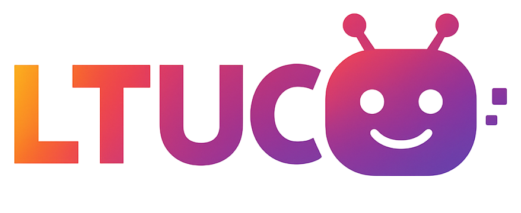

# 🎓 LTUC AI Assistant

<div align="center">
  
  
  **Intelligent Learning Companion for Modern Education**
  
  [](https://laravel.com)
  [](https://php.net)
  [](https://openai.com)
  [](https://tailwindcss.com)
</div>

## 📋 Table of Contents

-   [Overview](#-overview)
-   [Features](#-features)
-   [Technologies](#-technologies)
-   [Installation](#-installation)
-   [Configuration](#-configuration)
-   [Usage](#-usage)
-   [File Processing](#-file-processing)
-   [API Integration](#-api-integration)
-   [Contributing](#-contributing)
-   [License](#-license)

## 🌟 Overview

LTUC AI Assistant is a cutting-edge educational platform that leverages OpenAI's GPT-4o model to provide intelligent academic support. Built with Laravel 11 and modern web technologies, it offers students 24/7 access to an AI-powered learning companion capable of processing multiple file formats and providing comprehensive educational assistance.

### 🎯 Mission

Transform the educational experience by providing instant, intelligent, and personalized academic support through advanced AI technology.

## ✨ Features

### 🤖 Core AI Capabilities

-   **Advanced Conversational AI** - Powered by OpenAI GPT-4o for natural, intelligent responses
-   **Multi-Modal Processing** - Supports text, images, documents, and spreadsheets
-   **Contextual Understanding** - Maintains conversation context for coherent interactions
-   **Educational Focus** - Specifically tuned for academic and learning scenarios

### 📁 File Processing Support

-   **Documents**: PDF, DOCX, DOC, TXT, RTF
-   **Spreadsheets**: XLSX, XLS, CSV
-   **Images**: PNG, JPG, JPEG, GIF, BMP, WEBP
-   **Code Files**: PHP, JS, Python, Java, C++, HTML, CSS, JSON, XML
-   **Data Formats**: JSON, XML, YAML, SQL
-   **Archives**: ZIP (content extraction)

### 🔧 Advanced Features

-   **Image Analysis** - Extract text and analyze visual content using GPT-4o Vision
-   **Code Block Rendering** - Syntax-highlighted code display with copy functionality
-   **Markdown Support** - Rich text formatting and rendering
-   **File Upload** - Drag-and-drop interface with multiple file support
-   **Responsive Design** - Mobile-first, modern UI with Tailwind CSS
-   **User Authentication** - Secure login and registration system

### 🎨 User Experience

-   **Dark Theme Code Blocks** - Professional ChatGPT-like appearance
-   **Gradient Headers** - Beautiful pink-to-purple gradients
-   **Interactive Elements** - Hover effects and smooth animations
-   **Real-time Processing** - Instant file analysis and AI responses
-   **Copy to Clipboard** - Easy code and text copying functionality

## 🛠 Technologies

### Backend

-   **Laravel 11.31** - Modern PHP framework
-   **PHP 8.2+** - Latest PHP features and performance
-   **MySQL/SQLite** - Database management
-   **OpenAI PHP Client** - Official OpenAI API integration

### Frontend

-   **Tailwind CSS 3.1** - Utility-first CSS framework
-   **Alpine.js 3.4** - Lightweight JavaScript framework
-   **Vite 6.0** - Fast build tool and dev server
-   **FontAwesome 6.5** - Professional icon library

### File Processing Libraries

-   **PHPOffice/PhpSpreadsheet** - Excel and spreadsheet processing
-   **PHPOffice/PHPWord** - Word document processing
-   **Smalot/PdfParser** - PDF content extraction
-   **Spatie/PDF-to-Text** - Alternative PDF processing
-   **League/CommonMark** - Markdown parsing and rendering

## 🚀 Installation

### Prerequisites

-   PHP 8.2 or higher
-   Composer
-   Node.js 18+ and npm
-   MySQL or SQLite
-   OpenAI API key

### Step 1: Clone Repository

```bash
git clone https://github.com/your-username/ltuc-ai-assistant.git
cd ltuc-ai-assistant
```

### Step 2: Install Dependencies

```bash
# Install PHP dependencies
composer install

# Install Node.js dependencies
npm install
```

### Step 3: Environment Setup

```bash
# Copy environment file
cp .env.example .env

# Generate application key
php artisan key:generate
```

### Step 4: Database Setup

```bash
# Run migrations
php artisan migrate

# (Optional) Seed database
php artisan db:seed
```

### Step 5: Build Assets

```bash
# Development
npm run dev

# Production
npm run build
```

### Step 6: Start Development Server

```bash
# Laravel server
php artisan serve

# Asset watcher (in separate terminal)
npm run dev
```

## 🐳 Docker Deployment

### Docker Setup for Render

The project includes Docker configuration optimized for Render deployment:

#### Dockerfile
```dockerfile
# استخدم صورة PHP 8.2 مع CLI
FROM php:8.2-cli

# تثبيت الإضافات المطلوبة لـ Laravel + MySQL
RUN apt-get update && apt-get install -y \
    unzip \
    libpq-dev \
    libzip-dev \
    libpng-dev \
    libjpeg-dev \
    libfreetype6-dev \
    && docker-php-ext-install pdo pdo_mysql zip gd

# تثبيت Composer
COPY --from=composer:latest /usr/bin/composer /usr/bin/composer

# نسخ ملفات المشروع
WORKDIR /var/www
COPY . .

# تثبيت مكتبات Laravel
RUN composer install --no-dev --optimize-autoloader

# فتح المنفذ وتشغيل Laravel
EXPOSE 10000
CMD php artisan serve --host=0.0.0.0 --port=10000
```

#### .dockerignore
```
vendor
node_modules
.env
```

### Local Docker Commands

```bash
# Build Docker image
docker build -t ltuc-ai-assistant .

# Run container
docker run -p 10000:10000 --env-file .env ltuc-ai-assistant

# Access application
http://localhost:10000
```

### Render Deployment

1. **Push to GitHub**: Ensure Dockerfile and .dockerignore are committed
2. **Create Render Service**: Connect your GitHub repository
3. **Set Environment Variables**: Configure OpenAI API key and database
4. **Deploy**: Render will automatically build and deploy using Docker

## ⚙️ Configuration

### Environment Variables

Create your `.env` file with the following essential configurations:

```env
# Application
APP_NAME="LTUC AI Assistant"
APP_ENV=local
APP_KEY=base64:your-generated-key
APP_DEBUG=true
APP_URL=http://localhost:8000

# Database
DB_CONNECTION=mysql
DB_HOST=127.0.0.1
DB_PORT=3306
DB_DATABASE=ltuc_ai
DB_USERNAME=your_username
DB_PASSWORD=your_password

# OpenAI Configuration
OPENAI_API_KEY=your_openai_api_key_here
OPENAI_ORGANIZATION=your_org_id (optional)

# Mail Configuration
MAIL_MAILER=smtp
MAIL_HOST=mailpit
MAIL_PORT=1025
MAIL_USERNAME=null
MAIL_PASSWORD=null
MAIL_ENCRYPTION=null
MAIL_FROM_ADDRESS="hello@example.com"
MAIL_FROM_NAME="${APP_NAME}"
```

### OpenAI API Setup

1. **Get API Key**: Visit [OpenAI Platform](https://platform.openai.com/api-keys)
2. **Create New Key**: Generate a new secret key
3. **Add to Environment**: Set `OPENAI_API_KEY` in your `.env` file
4. **Set Usage Limits**: Configure billing and usage limits in OpenAI dashboard

### File Upload Configuration

Adjust PHP settings for large file uploads in `php.ini`:

```ini
upload_max_filesize = 50M
post_max_size = 50M
max_execution_time = 300
memory_limit = 512M
```

## 📖 Usage

### Basic Interaction

1. **Access the Application**

    ```
    http://localhost:8000
    ```

2. **Register/Login**

    - Create a new account or login with existing credentials
    - Access the chatbot at `/ltuc/chatbot`

3. **Start Chatting**
    - Type questions in the chat interface
    - Upload files by dragging and dropping or clicking the upload area
    - Receive AI-powered responses with formatted code blocks

### File Upload Examples

```php
// Upload multiple files
- Documents: research.pdf, notes.docx
- Code files: script.php, styles.css
- Images: diagram.png, chart.jpg
- Spreadsheets: data.xlsx, grades.csv
```

### Sample Interactions

**Text Questions:**

```
"Explain the concept of object-oriented programming"
"Help me understand calculus derivatives"
"What are the best practices for Laravel development?"
```

**File-based Questions:**

```
"Analyze this code and suggest improvements" + upload .php file
"Extract key points from this PDF" + upload document
"What does this diagram show?" + upload image
"Summarize this spreadsheet data" + upload .xlsx file
```

## 📄 File Processing

### Supported File Types

| Category         | Extensions                                             | Processing Method                 |
| ---------------- | ------------------------------------------------------ | --------------------------------- |
| **Documents**    | `.pdf`, `.docx`, `.doc`, `.txt`, `.rtf`                | Text extraction + AI analysis     |
| **Spreadsheets** | `.xlsx`, `.xls`, `.csv`                                | Data parsing + structure analysis |
| **Images**       | `.png`, `.jpg`, `.jpeg`, `.gif`, `.bmp`, `.webp`       | GPT-4o Vision API                 |
| **Code**         | `.php`, `.js`, `.py`, `.java`, `.cpp`, `.html`, `.css` | Syntax-aware processing           |
| **Data**         | `.json`, `.xml`, `.yaml`, `.sql`                       | Structure-aware parsing           |
| **Archives**     | `.zip`                                                 | Content extraction + analysis     |

### Processing Features

-   **Automatic Type Detection** - Smart MIME type and extension analysis
-   **Content Extraction** - Text, code, and data extraction from various formats
-   **Image Analysis** - OCR and visual content understanding via AI
-   **Error Handling** - Graceful fallbacks for unsupported or corrupted files
-   **Size Limits** - Configurable file size restrictions (default: 10MB for images)

## 🔌 API Integration

### OpenAI Configuration

The application uses OpenAI's latest models:

```php
// Chat Completions
'model' => 'gpt-4o',
'max_tokens' => 16000,
'temperature' => 0.7

// Vision API (for images)
'model' => 'gpt-4o-mini',
'detail' => 'high'
```

### Custom Controllers

**ChatbotController.php** - Main AI interaction handler:

-   Message processing and context management
-   File upload and analysis
-   Markdown parsing and rendering
-   Error handling and user feedback

### Response Formatting

Responses include:

-   **Raw Text** - Original AI response
-   **HTML** - Parsed markdown with syntax highlighting
-   **Code Blocks** - Formatted with copy functionality
-   **File Analysis** - Structured content extraction results

## 🎨 Customization

### Styling

The application uses a custom color scheme:

```css
/* LTUC Brand Colors */
.ltuc-primary {
    background-color: #d60095;
} /* Pink */
.ltuc-secondary {
    background-color: #2e8570;
} /* Green */
.ltuc-accent {
    background-color: #a84a9d;
} /* Purple */
.ltuc-dark {
    background-color: #333333;
} /* Dark Gray */
.ltuc-light {
    background-color: #999999;
} /* Light Gray */
```

### Code Block Theming

Professional dark theme with gradient headers:

```css
/* Code blocks with ChatGPT-like appearance */
.code-block-header {
    background: linear-gradient(135deg, #ec4899 0%, #8b5cf6 100%);
    color: white;
}
.code-block-content {
    background: #1e293b;
    color: white;
}
```

## 🤝 Contributing

We welcome contributions! Please follow these steps:

1. **Fork the Repository**
2. **Create Feature Branch**
    ```bash
    git checkout -b feature/amazing-feature
    ```
3. **Commit Changes**
    ```bash
    git commit -m 'Add amazing feature'
    ```
4. **Push to Branch**
    ```bash
    git push origin feature/amazing-feature
    ```
5. **Open Pull Request**

### Development Guidelines

-   Follow PSR-12 coding standards
-   Write comprehensive tests
-   Update documentation for new features
-   Ensure responsive design compatibility
-   Test file processing with various formats

### Code Style

```bash
# PHP Code Style (Laravel Pint)
./vendor/bin/pint

# Format JavaScript/CSS
npm run lint
```

## 📋 Requirements

### System Requirements

-   **PHP**: 8.2 or higher
-   **MySQL**: 5.7+ or **SQLite**: 3.8+
-   **Node.js**: 18.0 or higher
-   **Composer**: 2.0 or higher
-   **OpenAI API**: Valid API key with sufficient credits

### PHP Extensions

-   OpenSSL
-   PDO
-   Mbstring
-   Tokenizer
-   XML
-   Ctype
-   JSON
-   BCMath
-   GD or Imagick (for image processing)
-   ZipArchive (for ZIP file processing)

### Optional Dependencies

-   **ImageMagick** - Enhanced PDF to image conversion
-   **Tesseract OCR** - Improved text extraction from images
-   **Poppler Utils** - Better PDF processing

## 🔒 Security

### Security Features

-   **Input Validation** - Comprehensive file and input sanitization
-   **File Type Verification** - MIME type and extension validation
-   **Size Limits** - Configurable upload size restrictions
-   **CSRF Protection** - Laravel's built-in CSRF protection
-   **Authentication** - Secure user authentication system

### API Security

-   **Environment Variables** - Secure API key storage
-   **Rate Limiting** - Configurable API request limits
-   **Error Handling** - Secure error messages without sensitive data exposure

## 📊 Performance

### Optimization Features

-   **Lazy Loading** - Efficient resource loading
-   **Asset Minification** - Compressed CSS/JS files
-   **Database Indexing** - Optimized database queries
-   **Caching** - Laravel's built-in caching system
-   **Image Optimization** - Automatic image compression

### Monitoring

-   **Laravel Telescope** - Available for development debugging
-   **Error Logging** - Comprehensive error tracking
-   **Performance Metrics** - Response time monitoring

## 📚 Documentation

### Additional Resources

-   [Laravel Documentation](https://laravel.com/docs)
-   [OpenAI API Documentation](https://platform.openai.com/docs)
-   [Tailwind CSS Documentation](https://tailwindcss.com/docs)
-   [PHPOffice Documentation](https://phpoffice.github.io/)

### API Reference

-   **Chat Endpoint**: `/ltuc/chatbot`
-   **File Upload**: Multi-part form data with files array
-   **Response Format**: JSON with `reply` and `html_reply` fields

## 🐛 Troubleshooting

### Common Issues

**OpenAI API Errors:**

```bash
# Check API key configuration
php artisan config:clear
php artisan config:cache
```

**File Upload Issues:**

```bash
# Check PHP configuration
php --ini
# Verify upload_max_filesize and post_max_size
```

**Asset Building Problems:**

```bash
# Clear and rebuild assets
npm run build
php artisan view:clear
```

### Debug Mode

Enable debug mode in `.env` for detailed error messages:

```env
APP_DEBUG=true
LOG_LEVEL=debug
```

## 📄 License

This project is licensed under the MIT License - see the [LICENSE](LICENSE) file for details.

## 🙏 Acknowledgments

-   **OpenAI** - For providing advanced AI capabilities
-   **Laravel Team** - For the excellent PHP framework
-   **Tailwind CSS** - For the utility-first CSS framework
-   **PHPOffice** - For comprehensive file processing libraries
-   **FontAwesome** - For beautiful icons and symbols

---

<div align="center">
  <p><strong>Built with ❤️ for Better Education</strong></p>
  <p>© 2025 LTUC AI Assistant. All rights reserved.</p>
</div>
